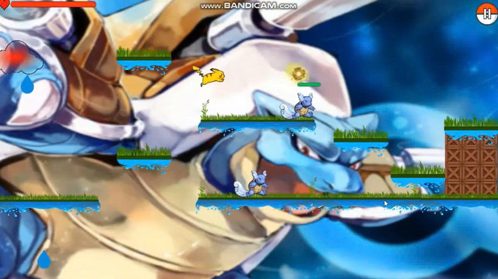

# 🎮 Team PTW — Games Portfolio

Tổng hợp các dự án game tôi đã xây dựng — từ ý tưởng, cốt truyện, level design đến gameplay implementation.

---

## Pikachu Adventure

**Thể loại:** 2D Platformer / Adventure / Boss Battle
**Nền tảng:** Windows PC (Download)
**Trạng thái:** Playable Demo
**Sự kiện:** Prompt-to-Play Hackathon

> *Fan-made prototype for educational/hackathon purposes only. This project is not affiliated with Nintendo, Game Freak, Creatures Inc., or The Pokémon Company.*

🎬 [Trailer](https://youtu.be/w4rS5_6raAo) · 🎮 [Demo Gameplay](https://youtu.be/4adZdZ18rYw)

### Project Overview

Pikachu Adventure là một game platformer hành động lấy cảm hứng từ thế giới Pokémon, được xây dựng cho cuộc thi Prompt-to-Play Hackathon. Người chơi điều khiển Pikachu vượt qua khu rừng nguy hiểm, đối đầu với các Pokémon hung dữ được xem như "boss" của từng khu vực, với mục tiêu cuối cùng là tìm đường trở về với Ash.

Dự án tập trung vào trải nghiệm chơi nhanh, dễ hiểu nhưng vẫn có thử thách: người chơi phải kết hợp di chuyển, nhảy qua địa hình, né chướng ngại vật và sử dụng kỹ năng chiến đấu để đánh bại boss.

### Cốt truyện

Ash và Pikachu là đôi bạn thân luôn đồng hành, và luôn bị Team Rocket phục kích hòng bắt Pikachu. Trong một lần chạm trán, Pikachu chẳng may thất lạc giữa rừng rậm. Cậu phải vượt qua những khu vực trắc trở và các Pokémon hung dữ — boss của từng vùng rừng — để tìm lại Ash. Khi đánh bại boss cuối cùng là Mewtwo, Pikachu được dịch chuyển trở về bên Ash, khép lại hành trình.

### Main Character — Pikachu

Khả năng di chuyển 4 hướng, nhảy qua nền đất, vượt chướng ngại vật và né đòn tấn công từ boss.

**Kỹ năng chiến đấu:**

- **Electro Ball** — Bắn cầu điện tấn công kẻ địch từ xa, gây sát thương an toàn trong khi giữ khoảng cách với boss.
- **Volt Tackle** — Lao nhanh về phía trước tấn công trực diện, tạo cảm giác mạnh mẽ và tốc độ cao khi cần áp sát đối thủ.

### Gameplay Design

Gameplay xây dựng theo hướng platformer hành động, yêu cầu người chơi vượt qua địa hình phức tạp (bục nhảy, khoảng trống, bẫy, vật cản) và khu vực boss. Trọng tâm gameplay nằm ở việc kết hợp ba yếu tố:

1. Di chuyển chính xác để vượt qua địa hình
2. Né đòn thông minh để sống sót trước boss
3. Sử dụng kỹ năng hợp lý để đánh bại kẻ địch

### Level Design

| Level | Tên | Mô tả |
|---|---|---|
| 1 | Forest Encounter | Làm quen di chuyển, nhảy, tấn công cơ bản. Boss đầu tiên là thử thách khởi động. |
| 2 | Fire Zone | Địa hình nguy hiểm hơn, nền đất nhỏ, khoảng cách xa, đòn tấn công bằng lửa. |
| Final | Mewtwo Battle | Trận chiến cuối, đòi hỏi vận dụng toàn bộ kỹ năng đã học. |

### Boss System

Boss đóng vai trò "người gác cổng" của từng khu vực, mỗi boss có hình dáng, môi trường và kiểu tấn công riêng. Boss không chỉ là kẻ địch mà còn góp phần kể chuyện — càng đi sâu vào rừng, Pikachu càng phải đối mặt với đối thủ mạnh hơn, tạo nhịp độ và cảm giác tiến bộ rõ ràng.

### Visual Direction

Phong cách hình ảnh rực rỡ, năng động, giàu tính hoạt hình với màu sắc nổi bật, hiệu ứng điện, lửa và chuyển động mạnh. Giao diện chính gồm màn hình menu (Play, How to Play, Exit); trong gameplay, thanh máu đặt ở góc trên màn hình.

### My Role

Tôi đảm nhận vai trò xây dựng ý tưởng, cốt truyện, thiết kế màn chơi và triển khai gameplay theo hướng full-stack:

- **Story Design** — Xây dựng cốt truyện Pikachu thất lạc, vượt qua boss để tìm đường về với Ash
- **Level Design** — Thiết kế các màn chơi theo tiến trình tăng dần độ khó, bố cục platform, vị trí chướng ngại vật, khu vực boss, nhịp di chuyển
- **Gameplay Design** — Cơ chế di chuyển, nhảy, tấn công bằng Electro Ball và Volt Tackle
- **Full-stack Game Development** — Triển khai toàn bộ trải nghiệm từ menu, gameplay, nhân vật, boss, hiệu ứng chiến đấu đến bản demo Windows PC

### Prompt-to-Play Process

1. Xây dựng concept và cốt truyện từ prompt ban đầu
2. Chuyển hóa concept thành gameplay cụ thể
3. Thiết kế nhân vật chính, kỹ năng và mục tiêu chiến đấu
4. Xây dựng các màn chơi có thử thách tăng dần
5. Tạo boss battle để tăng tính hành động và cảm giác hoàn thành
6. Hoàn thiện demo gameplay chạy trên Windows PC
7. Ghi lại trailer và video demo để trình bày sản phẩm

> Điểm quan trọng của dự án là khả năng biến một câu chuyện quen thuộc thành một vòng lặp gameplay rõ ràng: **khám phá → vượt chướng ngại → chiến đấu → đánh bại boss → tiến tới màn tiếp theo.**

### Key Features

- ✅ Playable 2D Platformer — điều khiển Pikachu trực tiếp trong môi trường platformer
- ✅ Boss Battle Gameplay — mỗi màn chơi có boss riêng, tạo điểm nhấn rõ ràng
- ✅ Skill-based Combat — Electro Ball (tấn công xa) và Volt Tackle (tấn công áp sát)
- ✅ Progressive Difficulty — độ khó tăng dần qua từng màn
- ✅ Windows PC Demo — đóng gói chạy trên ứng dụng Windows

### Project Outcome

Kết quả của dự án là một bản demo game có thể chơi được, bao gồm menu chính, các màn platformer, cơ chế chiến đấu, hệ thống boss và kết thúc game khi Pikachu đánh bại Mewtwo. Dự án thể hiện khả năng biến ý tưởng từ prompt thành sản phẩm game hoàn chỉnh ở mức demo, kết hợp storytelling, level design và game development.

---

## License & Disclaimer

Pokémon Adventure is a non-commercial, fan-made game concept created for educational, portfolio, and hackathon purposes only. Pokémon and all related characters are © Nintendo, Game Freak, Creatures Inc., and The Pokémon Company. This project is not affiliated with, endorsed by, or sponsored by any of the above rights holders.
